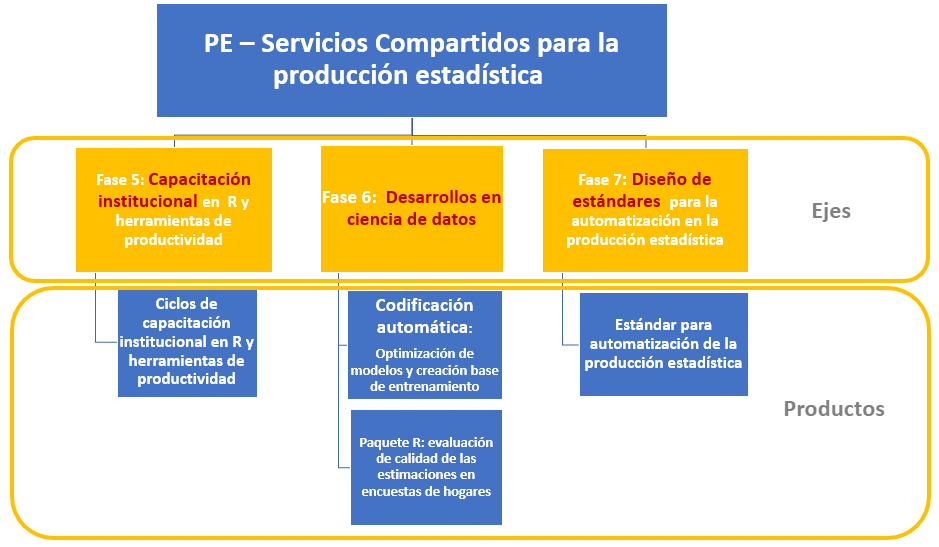
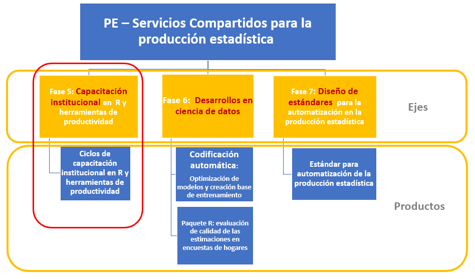

class: center, middle

.linea-superior[]
.linea-inferior[]


## Capacitación en R y herramientas de productividad

## Proyecto Estratégico Servicios Compartidos para la Producción Estadística

## Coordinación monitores/as

### Abril 2021

```{r setup, include=FALSE}
options(htmltools.dir.version = TRUE)
knitr::opts_chunk$set(message = FALSE) 
```

```{r xaringan-themer, include=FALSE, warning=FALSE}
library(xaringanthemer)
#style_duo_accent(
 # primary_color = "#1381B0",
  #secondary_color = "#FF961C",
  #inverse_header_color = "#FFFFFF"
#)
```


---

background-image: url("imagenes/fondo2.PNG")
background-size: contain;
background-position: 100% 0%

# PE Servicios Compartidos

--

.medium-par[Esta actividad de capacitación se enmarca en el **PE SSCC**.]

--

.medium-par[El PE SSCC es uno de los 4 proyectos estratégicos actualmente en funcionamiento en el INE (2018-2022).]

--

.medium-par[Este proyecto busca:]

--

*"Proveer a la institución de estándares y desarrollos que permitan .red[automatizar], .red[estandarizar], .red[ordenar] e .red[innovar] en la producción estadística, permitiendo reducir .red[tiempos] y .red[costos] del procesamiento y análisis de las diferentes operaciones estadísticas del INE y minimizando la probabilidad de .red[errores] en la publicación de resultados".* 

---

background-image: url("imagenes/fondo2.PNG")
background-size: contain;
background-position: 100% 0%

# Estructura PE SSCC



---

background-image: url("imagenes/fondo2.PNG")
background-size: contain;
background-position: 100% 0%

# Estructura PE SSCC



---
background-image: url("imagenes/fondo2.PNG")
background-size: contain;
background-position: 100% 0%

# Objetivos del aprendizaje

--

.medium-par[Al finalizar la capacitación se espera que las/os participantes:]

--

- **Estén familiarizados con el lenguaje de programación R** y cuenten con las habilidades necesarias para **profundizar aspectos de su interés** en este lenguaje.

--

- Sean capaces de **explorar** y **transformar** objetos en R.

--

- Manejen herramientas de **visualización** en R.

--

- Aprendan **buenas prácticas de escritura de código** en R.

--

- Conozcan **recomendaciones** que les permitan hacer **reproducibles** y **trazables** sus rutinas en R. 

---

background-image: url("imagenes/fondo2.PNG")
background-size: contain;
background-position: 100% 0%

# Organización de la capacitación

--
<br/>

- La capacitación de nivel básico se compone de **6 sesiones**.

--

- Las sesiones de realizarán **semanalmente**, en el **día y hora convenidos** con el/la capacitador/a.

--

- Se contempla una pausa de 10 minutos durante la sesión.

--

- Se sugiere indicar que si van surgiendo dudas, consulten durante la clase levantando la mano ✋. Pero  si ustedes prefieren algo más flexible, la decisión es de ustedes.

--

- Si las/os participantes tienen.pur[dudas que no apuntan directamente al contenido que se está revisando], recomendamos ofrezcan unos minutos para resolverlas al final de la clase, o bien .pur[les consulten durante la semana].

---

background-image: url("imagenes/fondo2.PNG")
background-size: contain;
background-position: 100% 0%

# Organización de la capacitación

--
<br/>

- Compartiremos cada presentación antes al inicio de la sesión. Si existen correcciones detectadas, actualizaremos el repositorio durante la semana posterior.

--

- Al finalizar cada sesión se les presentará un desafío para resolver durante la semana 🏠. **Estos desafíos no tienen impacto en la evaluación del curso** y .pur[Pueden ser desarrollados en forma individual o en grupos de 2 o 3 personas]. **Ya están desarrollados por el equipo de SSCC**

--

- El plazo para la entrega de estos desafíos es el **día antes de la siguente sesión de capacitación, a las 12:00 hrs**. En ese momento se subirá a nuestro canal en Teams la solución a los ejercicios. 

--

- El objetivo de pedirles los *scripts* es permitirnos .pur[conocer avances], .pur[reforzar contenidos] y .pur[retroalimentar] de considerarse pertinente.

--

- 🎥 Las clases serán grabadas para que puedan consultarlas en el futuro. **Se debe solicitar consentimiento para realizar esta grabación antes de comenzar cada clase**. .pur[SSCC solicitará permisos de grabación para el equipo de monitores/as]

---

background-image: url("imagenes/fondo2.PNG")
background-size: contain;
background-position: 100% 0%

# Asistencia y evaluación del curso

--
</br>

## Asistencia

--
</br>

- Se requerirá una **asistencia mínima al 80%** de las sesiones de capacitación. Equivale a 5 de las 6 sesiones.

--

- La asistencia es requerida por la SDA. **Deberan cotejar el listado con las personas conectadas**.

--

- Se permitirá justificar inasistencias por uso de permiso administrativo, feriado legal o por motivos laborales, **lo cual deberá ser informado por la jefatura del subdepartamento** al que la/el participante pertenece.

---

background-image: url("imagenes/fondo2.PNG")
background-size: contain;
background-position: 100% 0%

# Asistencia y evaluación del curso

--
</br>

## Evaluación del curso

--
</br>

- Las/os participantes deberán realizar una **tarea final**.

--

- Deben obtener una calificación mínima de 4 (en una escala de 1 a 7).

--

- Al igual que los desafíos semanales, esta tarea .pur[puede ser desarrollada en forma individual o en grupos de 2 o 3 personas].

--

- **La tarea final se entrega la penúltima clase** y tiene como plazo hasta una semana después de la última sesión.

---

background-image: url("imagenes/fondo2.PNG")
background-size: contain;
background-position: 100% 0%

# Experiencias piloto de Capacitación en R de SSCC

</br>
</br>
--

- .medium-par[Subdepto de Demografía y Estadísticas Vitales]

--

- .medium-par[Subdepto de Calidad Estadística]

--

- .medium-par[Depto de Gestión Estratégica]

---

background-image: url("imagenes/fondo2.PNG")
background-size: contain;
background-position: 100% 0%

# Presentación monitores/as

</br>
</br>
--

- .medium-par[¿En qué unidad se desempeñan? ¿Qué hacen?]

--

- .medium-par[¿Cuál es su experiencia con R? ¿Para qué lo usan?]

--

- .medium-par[¿Tienen experiencia capacitando? ¿Capacitando R? ]

---

background-image: url("imagenes/fondo2.PNG")
background-size: contain;
background-position: 100% 0%

# Preparación de la capacitación

</br>
--

- Se organizarán grupos de participantes con un **límite de 15** (se revisará con SDA).

--

- Se priorizará que las personas **capaciten a sus equipos o personas de areas similares**.

--

- Se capacitará en **duplas**.

--

- Si la convocatoria es alta se hará un **segundo ciclo**.

--

- Criterio para armar duplas: cercania temática, experiencia capacitando.

--

- **Iniciativa de la directora:** convocar a estudiantes universitarios y generar un grupo para capacitar.

--

- **Los grupos serán asignados** por SSCC - SDA cuando acabe la convocatoria.

---

background-image: url("imagenes/fondo2.PNG")
background-size: contain;
background-position: 100% 0%

# Metodología de capacitación

</br>
--

- Creación de un loop de 6 clases consecutivas

--

- Crearemos un Team y canales independientes para cada grupo donde los/as monitores/as serán administradores.

--

- **Antes de la primera clase se envía un instructivo** (ya diseñado) para la instalación de R y RStudio.

--

- Luego de cada clase **subir link de presentación y del video de la clase** en un post en su canal de Teams.

--

- Envío de tareas y revisión de tareas semanalmente (feedback personalizado).

--

- Se sube solucionario de la tarea (ya disponibles) un día antes de siguiente capacitación a las 12:00 hrs

---

background-image: url("imagenes/fondo2.PNG")
background-size: contain;
background-position: 100% 0%

# Proximos pasos

</br>
--

- Revisar presentaciones.

--

- Completar **encuesta individual de monitores en forms**

--

- Completar **Excel online con observaciones y consultas de monitores/as**

--

- Pueden **inscribir comentarios hasta el 16 de abril**

--

- A partir de las consultas se preparará una sesión en la **semana del 19 al 23 de abril** para **resolución de dudas y reforzamiento de contenidos**.

---

background-image: url("imagenes/fondo2.PNG")
background-size: contain;
background-position: 100% 0%

# Contenidos de la capacitación

--
</br>

**Sesión 1:** Introducción y herramientas de exploración de datos

    - ¿Qué es R y por qué usarlo?
    - La interfaz de R Studio
    - Tipos de datos y operaciones básicas
    - Exploración y manipulación básica de un data frame

--

**Sesión 2:** Procesamiento de bases de datos (1)

    - Importación de datos desde distintos formatos a R
    - Introducción a dplyr
    - Manipulación básica de columnas (select(), rename())
    - Manipulación básica de filas (arrange(), filter())
    - Herramientas básicas de edición de datos (if_else())

---

background-image: url("imagenes/fondo2.PNG")
background-size: contain;
background-position: 100% 0%

# Contenidos de la capacitación

--
</br>

**Sesión 3:** Procesamiento de bases de datos (2)

    - Herramientas básicas de edición de datos (mutate())
    - Funciones de agrupación (group_by(), summarise())
    - Tidy data (pivor_longer(), pivot_wider())

--

**Sesión 4:** Procesamiento de bases de datos (3)

    - Unión de bases de datos (joins, binds)
    - Manejo de variables de tiempo (fechas)

--

**Sesión 5:** Visualización de datos usando el paquete ggplot2

    - Visualizar para comunicar efectivamente
    - La gramática de los gráficos: visualizar datos con ggplot2  

---

background-image: url("imagenes/fondo2.PNG")
background-size: contain;
background-position: 100% 0%

# Contenidos de la capacitación

--
</br>

**Sesión 6:** En camino a la reproducibilidad

    - ¿Por qué es importante el trabajo reproducible?
    - Introducción a Rmarkdown – Instalación – ¿Qué es RMarkdown? 
    – Creando mi primer reporte con RMarkdown

--

- Se insta a que se **repliquen los contenidos de acuerdo a las pautas en todos los grupos**, para no generar diferencias.

---

background-image: url("imagenes/fondo2.PNG")
background-size: contain;
background-position: 100% 0%

# Links a presentaciones del ciclo de capacitación

- [Primera sesion](https://capacitacion-r-basico.github.io/sesion_1/#1)

- [Segunda sesion](https://capacitacion-r-basico.github.io/sesion_2/#1)

- [Tercera sesion](https://capacitacion-r-basico.github.io/sesion_3/#1)

- [Cuarta sesion](https://capacitacion-r-basico.github.io/sesion_4/#1)

- [Quinta sesion](https://capacitacion-r-basico.github.io/sesion_5/#1)

- [Sexta sesion](https://capacitacion-r-basico.github.io/sesion_6/#1)

- [Coordinación monitores/as](https://capacitacion-r-basico.github.io/Coordinacion-monitores/#1)

---

background-image: url("imagenes/fondo2.PNG")
background-size: contain;
background-position: 100% 0%

# Referencias

.medium-par[Nada de esto sería posible sin:]

- [R for Data Science, de Hadley Wickham](https://r4ds.had.co.nz/)

- [Advanced R, de Hadley Wickham](http://adv-r.had.co.nz/Introduction.html)

- [Data wrangling, exploration, and analysis with R, de Jenny Bryan](http://stat545.com/index.html)

- [Introduction to R, de Data Carpentry](https://datacarpentry.org/R-genomics/01-intro-to-R.html#functions)

- [Xaringan: Presentation Ninja, de Yihui Xie](https://github.com/yihui/xaringan). Para generar esta presentación con la plantilla ninja ⚔

.medium-par[R for Data Science tiene una traducción al español realizada por la comunidad hispana de R:]

- [R para ciencia de datos, de Hadley Wickham](https://es.r4ds.hadley.nz/)

---

class: center, middle

.linea-superior[]
.linea-inferior[]


## Capacitación en R y herramientas de productividad

## Proyecto Estratégico Servicios Compartidos para la Producción Estadística

## Coordinación monitores/as

### Abril 2021
